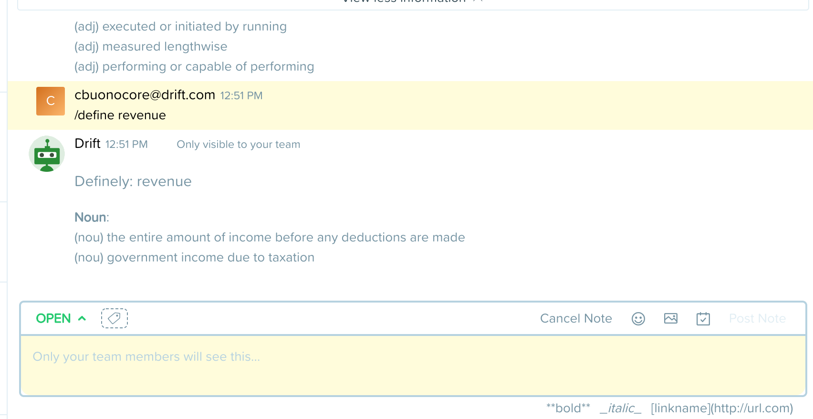

  
  Definely

Definely - A Drift word definition bot
---

Definely is a drift app written in Nodejs allowing agents to fetch definitions for words live within the drift conversation view.

This is an app used both at Drift and in the medium article "Your first Drift Bot Application".

### Setting up:

Define the following environment variable. You can get this from the 'Manage App' view of your app
<pre>
    DEFINELY_TOKEN={token}
</pre>

Then install the dependencies and start the app server.
<pre>
    yarn && yarn start
</pre>
The app should now be running on port 3001.

### Conversation View Output

### Third party tools
* https://www.twinword.com/api/word-dictionary.php
