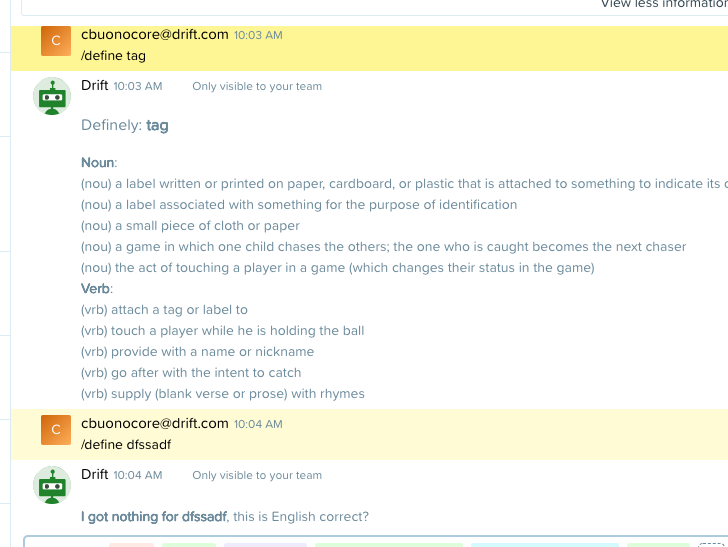
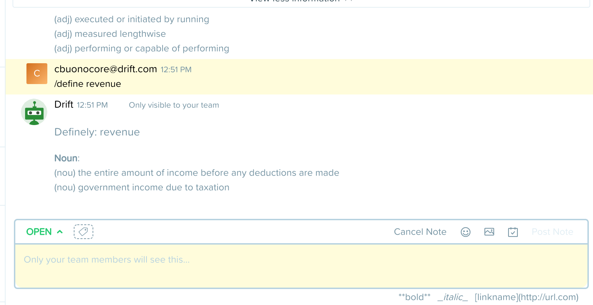

  
  

Definely - A Definition bot for drift conversations.
---

Definely is a drift app written in Nodejs allowing agents to fetch definitions for words live within the drift conversation view.

This is an app used both at Drift and in the medium article "Your first Drift Bot Application".

### Setting up:

Define the following environment variable. You can get this value from the 'Manage App' view of your app after you have installed the application to your drift org.

<pre>
    DEFINELY_TOKEN={token}
</pre>
Note that in a public app this token will be retrieved/managed via Oauth.

Lastly, install the dependencies and start the app server.
<pre>
    yarn && yarn start
</pre>
The app should now be running on port 3001.

### Screenshots

### Third party services:
* https://www.twinword.com/api/word-dictionary.php
